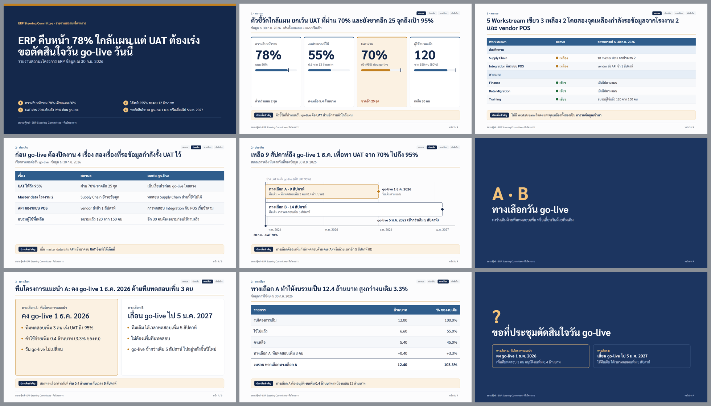
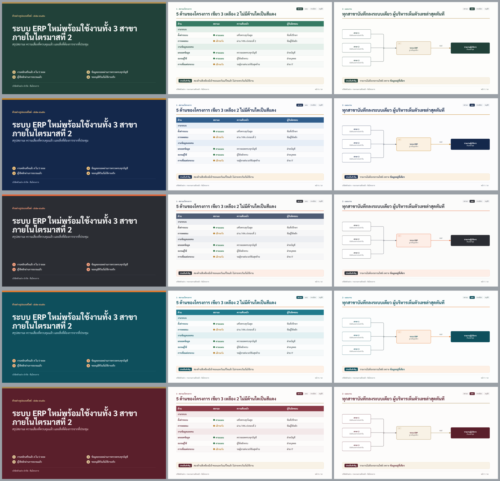

# slide-studio · Claude Code Skill สำหรับทำสไลด์นำเสนอ

Skill สำหรับ [Claude Code](https://claude.com/claude-code) ที่ทำสไลด์นำเสนอแบบมืออาชีพเป็น HTML ขนาด 1920×1080
ในสไตล์ **"action title"** แบบที่ปรึกษา: ทุกหน้ามีประเด็นเดียว หัวเรื่องบอกข้อสรุป เนื้อหาพิสูจน์ข้อสรุป
และมีแถบ **ประเด็นสำคัญ** ปิดท้ายหน้า พร้อม speaker notes และส่งออกเป็น PPTX / PDF ได้

**จุดเด่นคือ "ถามก่อนทำ"**: Skill จะสัมภาษณ์ทีละคำถาม (แบบ grill-me) พร้อมคำตอบที่แนะนำให้ทุกข้อ
จนได้ข้อสรุปเรื่องผู้ฟัง เป้าหมาย เนื้อหา โครงเรื่อง และ Theme ครบ แล้วจึงเริ่มทำสไลด์



## ความสามารถ

| | |
|---|---|
| **สัมภาษณ์ก่อนทำ** | ถามทีละข้อ ทุกข้อมีคำตอบแนะนำพร้อมเหตุผล อ่านไฟล์ที่มีอยู่ก่อนถาม สรุปเป็น `brief.md` และตารางหัวเรื่องทุกหน้า (ghost deck) ให้อนุมัติก่อนลงมือ |
| **4 ประเภทงาน** | หลักสูตรอบรม / workshop · นำเสนอผู้บริหาร / บอร์ด · Proposal / Pre-sales · รายงานสถานะโครงการ / Go-live readiness แต่ละแบบมีโครงเรื่อง ขนาดเด็ค และข้อควรระวังของตัวเอง |
| **Theme** | Preset 5 ชุด ให้ดูภาพตัวอย่างระหว่างสัมภาษณ์ หรือสร้าง Theme ใหม่จากเว็บไซต์ โลโก้ หรือรหัสสีของลูกค้า มีตัวตรวจความคมชัดของสี (contrast) |
| **Diagram** | รวม [diagram-design](#third-party) ทั้งชุด (42 ชนิด diagram พร้อมกฎการออกแบบ) วาดเป็น SVG ด้วยสีของ Theme อัตโนมัติ |
| **รูปแบบสไลด์** | ตาราง, ตาราง RAG, KPI tiles + แถบเทียบเป้า, phases, เปรียบเทียบทางเลือก, ตารางราคา, ขั้นตอนสาธิต, workshop, กรณีศึกษา, หน้าตัดสินใจ ฯลฯ ดูตัวอย่างครบใน `assets/templates/gallery.html` |
| **Handout** | เอกสารประกอบ A4 แนวนอนที่ใช้ Theme เดียวกับสไลด์ (สำหรับงานอบรมหรือเอกสารแจก) |
| **ตรวจคุณภาพ** | ตรวจเนื้อหาล้นหน้า (สไลด์ซ่อนส่วนที่ล้นแบบเงียบ ๆ) และกล่องประเด็นสำคัญที่ทับเส้นท้ายหน้า แล้ว render ทุกหน้าเป็นภาพรวมให้ตรวจด้วยตา |
| **ส่งออก** | PPTX (ภาพคมชัด 4K ต่อหน้า + speaker notes) และ PDF ส่วนการนำเสนอเปิดใน Chrome ได้เลย: `S` presenter view, `F` เต็มจอ, `O` overview |



| Preset | อารมณ์ | เหมาะกับ |
|---|---|---|
| `emerald-gold` | สุขุม น่าเชื่อถือ พรีเมียม | โรงพยาบาล ธุรกิจบริการพรีเมียม หลักสูตรอบรมองค์กร |
| `navy-amber` | ทางการ มั่นคง แบบบริษัทที่ปรึกษา | นำเสนอผู้บริหาร บอร์ด การเงิน Proposal |
| `charcoal-coral` | ทันสมัย เรียบ คม | Pre-sales ซอฟต์แวร์ Product demo งาน IT |
| `teal-orange` | สดใส เป็นมิตร แต่ยังเป็นมืออาชีพ | รายงานสถานะโครงการ Workshop ทีมปฏิบัติการ |
| `burgundy-sand` | ภูมิฐาน เป็นทางการสูง | ภาครัฐ กฎหมาย การเงิน งานพิธีการ |

## สิ่งที่ต้องมี

- [Claude Code](https://claude.com/claude-code)
- Python 3.8 ขึ้นไป (ตัวติดตั้งจะลง `python-pptx`, `pillow`, `pypdf`, `pypdfium2` ให้)
- Google Chrome หรือ Microsoft Edge (ใช้แบบ headless สำหรับตรวจ render และส่งออก)
- git (สำหรับติดตั้งแบบคำสั่งเดียว; บน Windows ถ้าไม่มี git ตัวติดตั้งจะดาวน์โหลด zip แทน)

## ติดตั้ง

**Windows (PowerShell)**

```powershell
irm https://raw.githubusercontent.com/owh-hwo/slide-studio-skill/main/install.ps1 | iex
```

**macOS / Linux / Git Bash**

```bash
curl -fsSL https://raw.githubusercontent.com/owh-hwo/slide-studio-skill/main/install.sh | bash
```

**หรือ clone แล้วติดตั้ง**

```bash
git clone https://github.com/owh-hwo/slide-studio-skill.git
cd slide-studio-skill
./install.sh            # Windows: .\install.ps1
```

ตัวเลือกของตัวติดตั้ง

| bash | PowerShell | ผล |
|---|---|---|
| *(ไม่ใส่)* | *(ไม่ใส่)* | ติดตั้งให้ผู้ใช้คนนี้ที่ `~/.claude/skills/slide-studio` ใช้ได้ทุกโปรเจกต์ |
| `--project` | `-Project` | ติดตั้งเฉพาะโปรเจกต์ปัจจุบันที่ `./.claude/skills/slide-studio` (commit ไปกับโปรเจกต์ได้) |
| `--no-deps` | `-NoDeps` | ไม่ติดตั้ง Python packages |
| `--uninstall` | `-Uninstall` | ถอนการติดตั้ง |

ถ้ามี slide-studio ติดตั้งอยู่แล้ว ตัวติดตั้งจะย้ายของเดิมไปเป็น `slide-studio.bak-<เวลา>` ไม่ลบทิ้ง
อัปเดตเป็นเวอร์ชันล่าสุดได้ด้วยการรันคำสั่งติดตั้งซ้ำ ถ้าหา Chrome ไม่เจอ ให้ตั้ง environment variable `CHROME` เป็น path ของโปรแกรม

หลังติดตั้ง **เปิด Claude Code ใหม่** (หรือเริ่ม session ใหม่)

## วิธีใช้

พิมพ์คำขอตามปกติ Skill จะทำงานเอง หรือเรียกตรง ๆ ด้วย `/slide-studio`

```
ทำสไลด์รายงานสถานะโครงการ ERP ให้ Steering Committee ประชุม 30 นาที
ช่วยทำ proposal ขายระบบให้ลูกค้าโรงงานผลิตชิ้นส่วนรถยนต์
ทำสไลด์อบรมผู้ดูแลระบบ 2 ครั้ง ครั้งละ 3 ชั่วโมง พร้อมเอกสารประกอบ
```

ขั้นตอนที่จะเกิดขึ้น

1. **สัมภาษณ์**: ประเภทงาน → ผู้ฟังและสิ่งที่ต้องการให้ตัดสินใจ → เนื้อหาและแหล่งข้อมูล → โครงเรื่อง → Theme → สิ่งที่ต้องส่ง
   (ตอบ "ตามที่แนะนำ" ได้ทุกข้อ) แล้วได้ `brief.md`
2. **Ghost deck**: ตารางหัวเรื่องทุกหน้า อ่านเรียงกันแล้วต้องเล่าเรื่องได้ครบ อนุมัติก่อนทำ HTML
3. **สร้างสไลด์** ในโฟลเดอร์โปรเจกต์ของคุณ
4. **ตรวจ**: เนื้อหาล้นหน้า, ระยะห่างจากเส้นท้ายหน้า, render ทุกหน้าแล้วดูด้วยตา, เวลารวมเทียบกับเวลาที่มี
5. **ส่งออก** PPTX / PDF

ผลลัพธ์ในโฟลเดอร์โปรเจกต์

```
brief.md                 ผลการสัมภาษณ์ + ghost deck + ประเด็นค้าง
<ชื่อเด็ค>.html          เด็ค (เปิดใน Chrome)
<ชื่อเด็ค> Handout.html   เอกสารประกอบ A4 (ถ้าเลือก)
assets/                  runtime + layout + theme.css (สี ฟอนต์ โลโก้)
diagrams/diagrams.py     โค้ด diagram ของเด็คนี้ (รันแล้ว SVG ถูกใส่ในเด็คให้เอง)
<ชื่อเด็ค>.pptx / .pdf    ไฟล์ส่งออก
```

## ใช้สคริปต์เองโดยตรง

ทุกสคริปต์อยู่ใน `~/.claude/skills/slide-studio/scripts/` รันจากโฟลเดอร์ไหนก็ได้

```bash
S=~/.claude/skills/slide-studio/scripts
python $S/new_deck.py ./my-deck --theme navy-amber --name "Board Update" --title "..." --footer "..." [--handout] [--gallery]
python $S/check_overflow.py "my-deck/Board Update.html"      # ต้องได้: no overflow, nothing near the footer rule
python $S/render_slides.py "my-deck/Board Update.html" out    # PNG ทุกหน้า + PDF
python $S/contact_sheet.py out                                # รวมทุกหน้าเป็นภาพเดียว out/sheet.png
python $S/build_pptx.py "my-deck/Board Update.html"           # PPTX (ปิดไฟล์ใน PowerPoint ก่อน)
python $S/preview_theme.py my-theme.json preview.png          # ดูตัวอย่าง Theme ที่สร้างเอง
```

เปลี่ยน Theme ของเด็คที่ทำเสร็จแล้ว: รัน `new_deck.py` ซ้ำด้วย `--theme` ใหม่และ `--name` เดิม (เนื้อหาไม่หาย)
แล้วรัน `diagrams/diagrams.py` อีกครั้ง

## สร้าง Theme เอง

คัดลอก `slide-studio/themes/<preset>.json` มาแก้สี ฟอนต์ และโลโก้ (ความหมายของแต่ละสีอยู่ใน
`references/themes.md`) แล้วใช้ `--theme path/to/my-theme.json` หรือบอก Claude ระหว่างสัมภาษณ์ว่าอยากได้
Theme จากเว็บไซต์หรือโลโก้ของลูกค้า แล้ว Claude จะสร้างและแสดงตัวอย่างให้เลือก

## โครงสร้าง repo

```
install.sh / install.ps1      ตัวติดตั้ง
slide-studio/                 ตัว Skill (ส่วนที่ถูกคัดลอกไปที่ ~/.claude/skills/)
  SKILL.md                    คำสั่งหลักของ Skill
  references/                 การสัมภาษณ์, ประเภทงาน, การเขียน, รูปแบบสไลด์, Theme, diagram, การตรวจ
  references/diagram/         diagram-design ทั้งชุด
  themes/                     Preset 5 ชุด (JSON)
  assets/                     runtime, layout CSS, ฟอนต์ Sarabun, template, ภาพตัวอย่าง Theme
  scripts/                    สคริปต์สร้าง ตรวจ render และส่งออก
docs/                         ภาพประกอบ README
```

## Third-party

- **html-ppt** runtime (`assets/runtime/`): MIT License, ดู `slide-studio/assets/runtime/html-ppt-LICENSE.txt`
- **diagram-design** (`references/diagram/`, `scripts/diagram_self_check.py`): MIT License
- **Sarabun** font (`assets/fonts/`): SIL Open Font License 1.1, ดู `slide-studio/assets/fonts/OFL.txt`

รายละเอียดใน [THIRD_PARTY_NOTICES.md](THIRD_PARTY_NOTICES.md)
